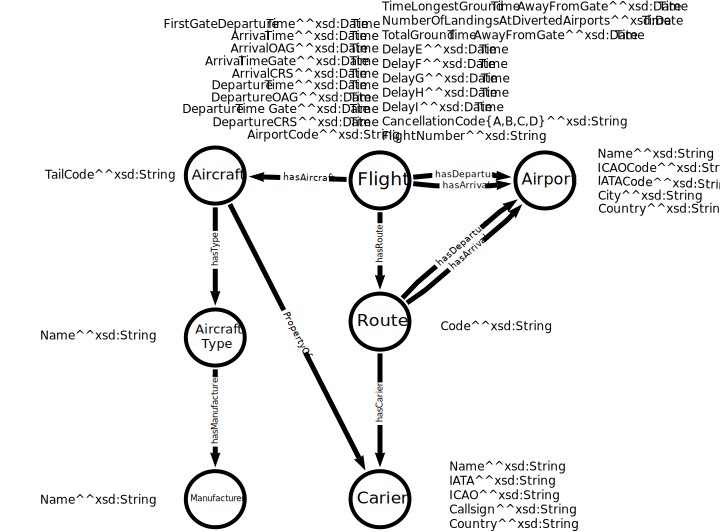

# FLYDATA - Domain and Data Selection

## Table of Contents
1. [Group Information](#group-information)
2. [Selected Datasets](#selected-datasets)
3. [Model Design](#model-design)
4. [Main Challenges](#main-challenges)
5. [Main Characteristics](#main-characteristics)

## Group Information
- **Group Name:** FLYDATA
- **Group Members:**
  1. Huimin Chen - huimin.chen@studenti.unipd.it - Computer Engineering
  2. Luca Pellegrini - luca.pellegrini.5@studenti.unipd.it - Computer Engineering
  3. Nele Lauryssen - nele.lauryssen@studenti.unipd.it - Computer Science

## Selected Datasets
1. **Airports**
   - URL: [https://raw.githubusercontent.com/jpatokal/openflights/master/data/airports.dat](https://raw.githubusercontent.com/jpatokal/openflights/master/data/airports.dat)
   - Description: Comprehensive dataset containing detailed information about airports worldwide.
   - Relevance: Starting and ending points of flights; potential for analyzing airport traffic.
   - Note: Extended version available at [https://github.com/jpatokal/openflights/blob/master/data/airports-extended.dat](https://github.com/jpatokal/openflights/blob/master/data/airports-extended.dat)

2. **Planes**
   - URL: [https://github.com/jpatokal/openflights/blob/master/data/planes.dat](https://github.com/jpatokal/openflights/blob/master/data/planes.dat)
   - Description: List of planes with Name, IATA code, ICAO code.
   - Relevance: Essential for flight operations.

3. **Airlines**
   - URL: [https://raw.githubusercontent.com/jpatokal/openflights/master/data/airlines.dat](https://raw.githubusercontent.com/jpatokal/openflights/master/data/airlines.dat)
   - Description: List of airlines with detailed information.
   - Relevance: Flight operators; potential for performance analysis.

4. **Routes**
   - URL: [https://raw.githubusercontent.com/jpatokal/openflights/master/data/routes.dat](https://raw.githubusercontent.com/jpatokal/openflights/master/data/routes.dat)
   - Description: List of routes with comprehensive flight planning information.
   - Relevance: Connects airports; provides insights into flight planning and route popularity.

5. **Countries**
   - URL: [https://raw.githubusercontent.com/jpatokal/openflights/master/data/countries.dat](https://raw.githubusercontent.com/jpatokal/openflights/master/data/countries.dat)
   - Description: List of countries with ISO and DAFIF codes.
   - Relevance: Contextual information for airports; potential impact on flight quantity and route planning.

6. **Cities**
   - URL: [https://simplemaps.com/data/world-cities](https://simplemaps.com/data/world-cities)
   - Description: List of cities with geographic and demographic information.
   - Relevance: Context for airports; potential correlation between population and route numbers.

7. **Airline Service Quality Performance 234 (On-Time performance data)**
   - URL: [https://www.bts.gov/browse-statistical-products-and-data/bts-publications/airline-service-quality-performance-234-time](https://www.bts.gov/browse-statistical-products-and-data/bts-publications/airline-service-quality-performance-234-time)
   - Relevance: Insights into airline performance and on-time statistics.

8. **Runways**
   - URL: [https://ourairports.com/data/](https://ourairports.com/data/)
   - Description: Detailed runway information including dimensions and characteristics.
   - Relevance: Critical for understanding airport capacity and operations.

9. **Frequencies**
   - URL: [https://ourairports.com/data/](https://ourairports.com/data/)
   - Description: List of airport frequencies.
   - Relevance: Important for air traffic control and communication.

10. **Delay Causes**
    - URL: [https://www.kaggle.com/datasets/sriharshaeedala/airline-delay](https://www.kaggle.com/datasets/sriharshaeedala/airline-delay) or [https://www.transtats.bts.gov/ot_delay/ot_delaycause1.asp](https://www.transtats.bts.gov/ot_delay/ot_delaycause1.asp)
    - Description: Detailed information on flight delays and their causes.
    - Relevance: Critical for analyzing and understanding flight delays.

## Model Design

### Main Entities
1. Flight: flight number, departure time, arrival time, departure airport, arrival airport, route, aircraft etc.
2. Airport: name, code, etc.
3. Route: name
4. Aircraft: name, code, etc.
5. AircraftType: name, etc.
6. Manufacturer: name, etc.
7. Carrier: name, code, etc.

### Relationships
1. Flight - Airport: "hasDeparture"
2. Flight - Airport: "hasArrival"
3. Flight - Route: "hasRoute"
4. Flight - Aircraft: "hasAircraft"
5. Aircraft - AircraftType: "hasType"
6. AircraftType - Manufacturer: "hasManufacturer"
7. Route - Airport: "hasDeparture"
8. Route - Airport: "hasArrival"
9. Route - Carrier: "hasCarrier"
10. Aircraft - Carrier: "PropertyOf"

This model enables flexible querying and analysis, such as:
- Finding all routes from a specific airport
- Analyzing airline operations across different countries
- Exploring the relationship between city population and airport traffic

The model is extensible to include additional entities like Planes, Runways, and Delay Causes for more detailed analysis.

## Main Challenges

1. Data Integration: Combining multiple datasets with varying formats and structures.
2. Data Quality: Ensuring accuracy and completeness across all datasets.
3. Data Volume: Managing large amounts of frequently updated data.
4. Temporal Alignment: Dealing with time zone differences and aligning data from different periods.
5. Relationship Mapping: Establishing correct relationships between entities across datasets.
6. Data Cleaning: Handling missing values, duplicates, and errors in raw datasets.
7. Performance Optimization: Designing efficient queries and data structures for complex analyses.

## Main Characteristics

1. Global Coverage: Comprehensive worldwide information on air travel.
2. Multi-dimensional: Spans geographic, operational, and performance-related aspects.
3. Interconnected: Allows for complex analyses across different entities in the air travel ecosystem.
4. Wide Application: Useful for flight planning, route optimization, performance analysis, and customer service.
